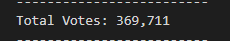
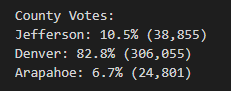
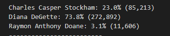
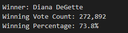

# Module3_Challenge

# Overview of Election Audit: Explain the purpose of this election audit analysis.
The purpose of this election audit analysis was to collect not only the candidate’s election results but the breakdown of total voter turnout for each county. 

### Election-Audit Results: Using a bulleted list, address the following election outcomes. Use images or examples of your code as support where necessary.
- How many votes were cast in this congressional election?
 
     
- Provide a breakdown of the number of votes and the percentage of total votes for each county in the precinct. _See Image Below_

     
- Which county had the largest number of votes?

      -  Denver had the largest amount of votes 
- Provide a breakdown of the number of votes and the percentage of the total votes each candidate received. _See Image Below_
     
- Which candidate won the election, what was their vote count, and what was their percentage of the total votes? _See Image Below_
     

### Election-Audit Summary: In a summary statement, provide a business proposal to the election commission on how this script can be used—with some modifications—for any election. Give at least two examples of how this script can be modified to be used for other elections.

As we can see from this analysis, we can rely on data analytic tools to provide total vote counts in an efficient amount of time. The system can calculate totals in the matter of seconds. The script used for this election was just one of many versions that can be used as it can be applied to any election to calculate and share total results. We can modify the text file with new data. If the headers remain the same then there is less need for modification in the code, simply the file path to the file we are reading from will need updating. Depending on the data given we can pull many insights to present. For example, in this election, we can tell from the data that not only was Denver the county with the largest number of votes, but it actually made up roughly 83% of the total population of voters for this election. As a candidate in future elections this insight provides me on how to plan my campaign more strategically to target where most of the voters may be. For the purpose of this being a county election we kept variables with county verbiage however we can easily modify variables, lists and dictionaries names, such as "largest_county" to be "largest_state" instead for a state election and so one. Lastly, we can even modify the script to collect and analyze data for multiple elections within one race. So, for example, if we have two positions we are collecting votes for to have winners we can include both results in the one analysis. To do this we would still be able to follow most of the script and duplicate what is currently on our script as “tracking the winning candidate” to “tracking the winning x) (x could be president/mayor/etc). Then the only major modification to be made would be ensuring the candidates name is aligned with the correct row and ensuring there are 2 separate loops running through extracting data for the correct position. 
